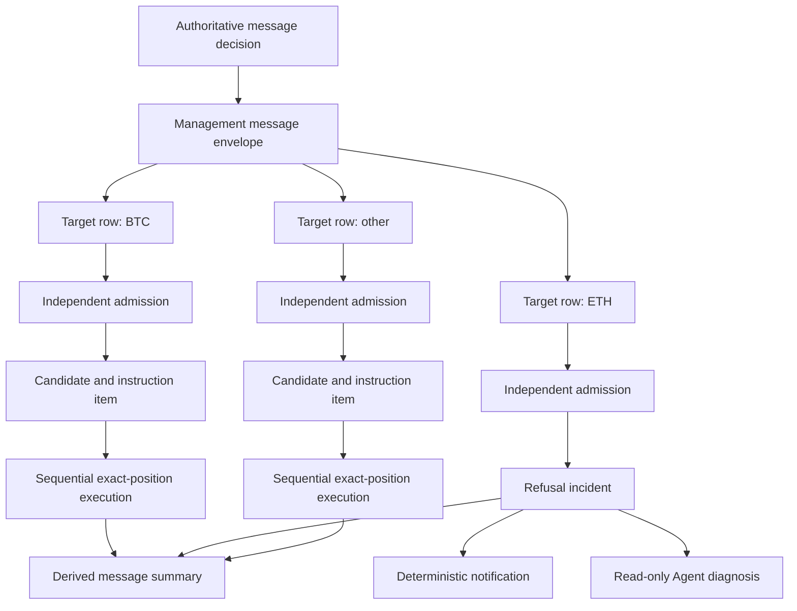

# Multi-Target Isolation and AI Agent Notification Design

## Goal

Make every explicitly named position target in one Telegram management message
independent, so one target's refusal, failure, or unknown result never blocks an
unrelated target. Capture every durable operation failure for audit and ensure
the Runtime Incident AI Agent participates at least through diagnosis and
notification, without becoming a second targeting or trading authority.

This design supersedes the all-or-nothing target-validation rule in
`2026-08-07-position-message-compliance-repair-design.md`.

## Fixed requirements

- First-pass MiMo recognition and contextual multi-information resolution stay
  authoritative for message intent and target identity.
- Each target is admitted, persisted, executed, reconciled, and reported
  independently.
- A target failure may freeze only that target or its exact ownership collision
  group. It must not gate unrelated targets.
- Message-level status is a derived summary, never an execution gate.
- Every durable terminal failure is captured as a bounded, redacted
  `RuntimeIncident`.
- Deterministic notification does not wait for AI availability.
- The Agent is read-only: it may diagnose and explain but may not select a
  substitute target, create a management batch, replay a message, or mutate a
  position.
- Every Agent-originated operator notification uses the title format
  `AI agent通知：（内容）`.
- Do not replay historical messages or create live test orders.

## Selected approach

Extend the existing authoritative path with a typed message envelope and one
durable target row per explicit target. Reuse the existing one-candidate and
one-instruction-item execution path after a target is admitted. Add a universal
incident bridge at durable error boundaries, then route explicit incident types
through deterministic notification and the existing read-only Agent.

Two alternatives were rejected:

1. Splitting one Telegram message into synthetic messages loses the original
   message's shared evidence and makes deduplication and operator reporting
   misleading.
2. Letting the Agent compensate, replay, or choose targets creates a second
   targeting authority and risks acting on stale account state.

## Architecture and authority boundaries



Execution remains sequential to avoid account-level concurrency races. A
terminal result for one instruction item, including `failed`, `submit_unknown`,
or `recovery_required`, releases the worker to claim the next unrelated item.
This is isolation, not parallel exchange submission.

The only target-to-target coupling is an exact ownership collision. Before
execution, build collision groups from verified `posId` and execution-binding
ownership. Targets with disjoint exact positions form independent groups. If
two requested targets overlap the same exact position or ownership is
conflicting, freeze and report that collision group only.

Global infrastructure faults are not target faults. An unavailable database,
unreadable immutable raw message, or invalid whole-message schema may pause the
envelope because no target can be proven safe. The resulting incident must say
that it is envelope-scoped rather than attributing it to one target.

## Data model

Add two additive ledgers.

### Management message envelope

`management_message_envelopes` stores:

- immutable `raw_message_id` and authoritative decision fingerprint;
- normalized action and bounded shared parameters;
- projection mode (`shadow` or `live`);
- created and updated timestamps.

It does not own a mutable execution status. Its displayed aggregate is derived
from target rows so stale summary data can never gate work.

### Management message target

`management_message_targets` stores one row for every declared target,
including rejected targets:

- envelope, raw message, lifecycle, symbol, and side;
- target ordinal and normalized action;
- bounded parameter JSON and fingerprint;
- collision-group fingerprint;
- admission state and closed reason code;
- execution state;
- candidate and instruction-item references when admitted;
- latest target-scoped runtime incident reference;
- timestamps for admission, execution progress, and terminal state.

The target state machine is:

```text
identified -> validating -> admitted/refused
admitted -> pending -> executing -> submitted -> confirmed
executing/submitted -> failed/submit_unknown/recovery_required
```

Use a unique idempotency identity based on `raw_message_id`, target lifecycle,
normalized action, and parameter fingerprint. Reprocessing must return the same
target row and must not duplicate a candidate, instruction item, exchange
operation, or incident generation.

Per-target database savepoints isolate validation and persistence defects. A
database-wide transaction or connectivity failure remains envelope-scoped.

## Supported multi-target action matrix

The safety property is risk reduction. The target set may contain only actions
whose safety can be proven independently.

| Action | Initial disposition | Constraint |
| --- | --- | --- |
| Partial take profit | Live after parity shadowing | Exact target and bounded fraction |
| Full exit | Add in target-isolated rollout | Exact live position only |
| Partial exit | Add in target-isolated rollout | Exact target and bounded fraction |
| Cancel pending entry | Add in target-isolated rollout | Exact owned pending legs only |
| Break-even/protect | Later shadow phase | Per-target risk-reduction verification |
| Informational hold update | Supported as non-executable | Target audit only |
| Add, reverse, revise, increase risk | Never fan out | Refuse without blocking valid risk-reducing targets |
| Shared explicit stop/TP value | Refuse initially | Require explicit per-target parameters first |

The persistence validator must match the contextual contract. The current
validator accepts only explicit multi-target `partial_take_profit`, while the
context layer can express cancel and exit actions. The repair replaces this
single-action check with a closed action policy shared by both paths.

Mixed target actions are deferred until the same message contract carries an
explicit action and parameter set for every target. Even then, each action must
be independently risk-reducing.

## Error taxonomy and incident boundary

Every durable boundary catches only closed, named failures. A bounded
`unclassified_operation_failure` is allowed at top-level worker boundaries so
unexpected exceptions cannot disappear, but it never acts as a wildcard policy
selector.

Incident families are:

- recognition and evidence: provider retry exhausted, authoritative schema
  rejection for high-risk text, claim exhaustion, and context exhaustion;
- target admission: missing or non-live target, wrong chat/symbol/side,
  ownership conflict, target newer than the message, unsafe action, and exact
  position collision;
- orchestration: admitted target missing its candidate or instruction item,
  item visibility retry exhaustion, and deadline exhaustion;
- entry and management: submission unknown, partial leg failure, binding
  conflict, blocked management, partial management failure, recovery required,
  and target drift;
- protection and mutation: stale mutation intent, incomplete replacement,
  missing primary/backup role, compensation failure, and ownership conflict;
- reconciliation: incomplete exchange snapshot, local/exchange drift, and
  cleanup failure;
- monitor and scanner: adapter failure, audit incomplete, and insufficient
  facts;
- notification: delivery failure;
- Agent: provider, tool, claim, diagnosis, or handoff failure.

Incident capture is fail-open relative to already authorized trading work. An
incident-write failure cannot roll back another target's valid business
transaction; it is retried through a bounded outbox or captured by the
top-level monitor.

## Severity and notification policy

| Priority | Examples | Operator behavior |
| --- | --- | --- |
| P0 | Unknown exchange outcome, unprotected live position, partial multi-target execution | Immediate deterministic alert plus Agent diagnosis |
| P1 | High-risk message has no executable item, context exhausted, target drift | Immediate deterministic alert plus Agent diagnosis |
| P2 | Safe target refusal, transient error recovered | Grouped summary; Agent diagnosis when useful |
| P3 | Obsolete work, duplicate input, expected safe suppression | Audit only or periodic digest |

Transient errors are persisted as observations and retried. A recovered
transient is closed and summarized rather than alerted immediately. Retry
exhaustion, an unknown result, or live-risk impact promotes the event to an
immediate incident.

For one multi-target message, separate incident rows remain target-scoped.
Notification rendering may group simultaneous rows by envelope to avoid a
storm, but it must list successful, refused, failed, and unaffected targets
separately.

Every operator-facing message emitted by this feature starts with exactly:

```text
AI agent通知：（bounded, redacted content）
```

The deterministic base alert is sent first. The Agent may append or update a
diagnostic explanation later. If the Agent is unavailable, the base alert is
still complete enough to identify the message, target, action, state, risk, and
recommended safe operator check.

## Runtime Agent behavior

The Agent receives only a durable incident and bounded stable references. Its
read-only tools may retrieve:

- authoritative message evidence and decision metadata;
- the affected target, lifecycle, binding, and instruction item;
- fresh bounded exchange snapshots and management reconciliation evidence;
- protection-role ledgers and notification-delivery evidence.

The Agent must not receive credentials, raw provider output, or unbounded raw
Telegram history. Its output is a diagnosis, evidence references, confidence,
risk classification, and operator-readable next check. Action authority stays
false and both playbook action allowlists stay empty.

Agent failures create their own explicit incident. They do not suppress,
replace, or delay the source incident notification.

## Aggregate reporting

Derive the envelope display status from terminal target rows:

- `succeeded`: every executable target confirmed and no target was refused;
- `partial_success`: at least one target confirmed and at least one was
  refused or failed;
- `attention_required`: no confirmed failure is safe to ignore, or any target
  is `submit_unknown`/`recovery_required`;
- `failed`: no target confirmed and all targets terminally refused or failed.

This derived status is never queried to decide whether an instruction item can
run.

For Shu Qin message 3465, a valid BTC target must complete its 50% partial take
profit even if ETH admission or execution fails. The result is
`partial_success`, with BTC success evidence and an ETH-scoped incident.

## Rollout and rollback

1. Add envelope and target ledgers dormant; project new messages in shadow mode
   without changing candidate creation.
2. Compare shadow rows with the existing partial-take-profit path and repair
   discrepancies.
3. Enable target-isolated admission for new multi-target partial take-profit
   messages behind a dedicated switch.
4. Shadow, then canary, full exit, partial exit, and cancel-pending-entry one
   action at a time.
5. Add break-even/protect only after per-target risk checks pass in shadow.
6. Add explicit incident adapters capture-only, one incident type at a time.
7. Canary deterministic notification selectors one explicit type at a time.
8. Canary Agent diagnosis selectors only after the corresponding deterministic
   notification is verified.
9. Add proactive compliance scanner rules in dormant, shadow, notification,
   and Agent-diagnosis stages.

Each stage has an independent disable switch and preserves the current path.
No deployment occurs during an active time-sensitive strategy operation. No
historical message is replayed. Verification uses fixtures, isolated databases,
read-only server inspection, and natural future messages rather than live test
orders.

The Runtime Incident Agent status remains controlled by
`docs/runtime-incident-agent-status.md`. Implementation must not skip or combine
its current phase with a later runtime phase in one user turn.

## Test strategy

Required automated coverage includes:

- one invalid target while other targets create candidates and items;
- one planner or executor failure while unrelated items continue;
- one `submit_unknown` freezing only its exact target/collision group;
- overlapping `posId` targets freezing only the overlap group;
- idempotent replay without duplicate target rows, work, or incidents;
- action-policy parity between contextual resolution and persistence;
- multi-target full exit, partial exit, cancel, and partial take profit;
- refusal of risk-increasing and unsafe shared-parameter actions;
- correct derived aggregate status for every terminal combination;
- deterministic base alert using `AI agent通知：（内容）`;
- Agent diagnostic addendum and graceful Agent-provider failure;
- grouped notification without loss of target-specific incident rows;
- target-order permutation producing the same independent outcomes;
- dormant and shadow switches producing no production execution change.

Server verification must confirm schema parity, focused tests, safe-window
state, disabled/canary flags, service health, Agent read-only authority, empty
action allowlists, and unchanged trading state when no natural qualifying
message arrives.
