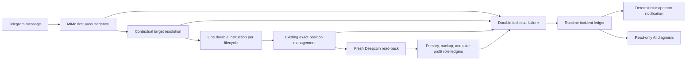

# Position-to-Message Compliance Repair Design

## Goal

Repair the complete path from a Telegram position-management message to exact
Deepcoin position execution, protection-role persistence, runtime-incident
capture, and operator notification. The repair must preserve the existing
first-pass MiMo authority, contextual strategy resolution, exact verified
`posId` ownership, and fail-closed execution gates.

This design addresses two production findings:

- message 3465 correctly identified both live BTC-short and ETH-short targets
  for partial take profit, but contextual resolution ended in
  `contract_error`, so neither exact target produced executable work;
- message 4157 successfully moved one BTC-long stop to 64100 while retaining
  take profit at 67000, but the replacement path did not converge the new
  primary/backup roles across every protection ledger, so health auditing
  reported a missing backup stop despite exact exchange read-back evidence.

The design also closes the notification gaps that kept both conditions silent.

## Non-goals and authority boundaries

- Do not replay message 3465 or any other old Telegram management message.
- Do not let the Runtime Incident Agent choose a strategy target or create a
  management batch.
- Do not infer ownership from symbol, side, price, proximity, or a lone
  remaining position.
- Do not enable Runtime Agent action authority or populate either playbook
  allowlist.
- Do not create a live order, synthetic Telegram signal, or protection update
  to verify the repair.
- Do not rewrite or delete historical incident rows.

## Considered approaches

### 1. Repair the authoritative path and add read-only detection

Fix multi-target contextual resolution, durable failure handling, notification
routing, and protection-role convergence in their existing authoritative
components. Keep the Runtime Agent as a read-only detector and diagnostic
consumer.

This is the selected approach. It fixes the causes at their source and keeps
one owner for strategy targeting and one owner for business execution.

### 2. Use the Runtime Agent as the primary compensator

Leave the business path unchanged and have the Agent detect missed operations
and propose or execute repairs. This would leave a known loss window and create
a second strategy-targeting system, so it is rejected.

### 3. Replace the current workers with a unified coordinator

Move recognition, contextual resolution, execution, protection, and
notification into a new state machine. Although internally consistent, this is
too broad and risky for a production trading system with active positions.

## Architecture

The repair has two layers:

1. the authoritative business path must correctly resolve and execute new
   messages, then persist complete exchange evidence;
2. deterministic incident capture and read-only Agent diagnosis must detect and
   report terminal technical failures without owning business decisions.

Every new capability remains dormant or shadow-only on first deployment and
has an independent rollback switch.

## Multi-target position management

### Message-level intent and target-level work

The authoritative payload may contain multiple structured targets only for an
explicit risk-reducing directive. Each target contains:

- `target_lifecycle_id`;
- normalized `symbol`;
- normalized `side`.

The contextual resolver must be able to express a multi-target
`partial_take_profit` decision. The safest contract is to treat it as one
risk-reducing management decision whose `target_thread_ids` contains every
explicit target and whose `risk_reducing_fanout_allowed` is true. This is not a
general relaxation: stop changes, revisions, additions, reversals, and mixed
risk directives remain single-target or refused.

Before persistence, validate every target against the same immutable source
message:

- same Telegram `chat_id`;
- unique active lifecycle and strategy thread;
- unique execution binding;
- exact verified nonterminal entry legs;
- every live `posId` created before the management message;
- no target outside the explicit message symbols and sides;
- no risk-increasing clause.

This paragraph is superseded by
`docs/plans/2026-08-07-multi-target-isolation-agent-notification-design.md`.
Validation and execution are target-isolated: an ambiguous or unsafe target is
refused and audited without preventing unrelated, valid targets from creating
and completing executable work. Only targets that resolve to the same exact
position ownership are placed in one collision group and frozen together.

Once validation succeeds, reuse the existing multi-instruction orchestration
to create one `SignalCandidate` and one `MessageInstructionItem` per lifecycle
in one transaction. Each item is executed independently through the existing
planner and exact-position executor, while the message summary reports each
target separately. Existing idempotency keys prevent a second execution of the
same message and target.

Historical message 3465 is a read-only replay fixture only. Deployment never
claims or executes it.

## Context failure state machine

`network_error`, `malformed_json`, and `contract_error` use one bounded state
machine:

1. persist a safe error code for the immutable context fingerprint;
2. retry once with the same evidence and candidate set;
3. on a second failure, transition the attempt to `exhausted`;
4. append one `context_worker_exhausted` runtime incident;
5. send a deterministic high-risk failure notification independently of retry
   and incident diagnosis.

The rejected provider body remains unpersisted. The validator returns a closed
reason code such as `multi_target_action_not_allowed`,
`target_outside_candidate_set`, or `management_action_incompatible`, rather
than collapsing every rejection into `contract_error`.

Retry ownership must not depend on notification delivery. A notification
failure creates its own `notification_delivery_failure` incident and cannot
hide or replace the original context incident.

High-risk failure classification continues to suppress empty sticker input and
obvious non-crypto external-market noise. Text that names crypto, an active
position, take profit, stop loss, exit, protection, or position management is
never suppressed.

## Notification routing

Split the currently overloaded listener configuration into two explicit
channels:

- `system_operator_bot_config` receives authoritative recognition failures,
  runtime incidents, attribution/protection incidents, and other operator
  actions;
- `notification_bot_config` receives ordinary business summaries.

The live listener, manual-recognition endpoint, and reconciliation workers must
receive both named configurations. A missing ordinary notification bot cannot
disable system-operator alerts. A missing system-operator bot records a
notification failure; it never silently selects an unapproved chat.

Runtime incident capture, Telegram delivery, and Agent diagnosis keep separate
exact allowlists. No wildcard is accepted.

## Protection-role convergence

The existing composite protection executor already creates and verifies a new
primary stop and backup stop before cancelling old protection. The legacy
management replacement path must reuse the same role-aware persistence rules
instead of writing every new stop as generic `stop_loss`.

For each exact position replacement, persist in one transaction after verified
read-back:

- `PositionProtectionLedger` with `stop_loss`, `backup_stop`, or
  `take_profit` purpose;
- `PositionProtectionLeg` with the corresponding role and exchange order ID;
- `PositionBackupStopOrder` for the active exact backup stop;
- `PositionProtectionRevision` containing the complete ordered replacement
  set.

Role comes from the reviewed request plan and idempotency identity, not price
or candidate matching. The primary stop uses the requested position size; the
backup is the separately planned exact position-level fallback. Both must have
exact order IDs, `posId`, instrument, side, trigger, size semantics, and current
pending read-back.

The management batch becomes `succeeded` only when every required role is
verified and the old replacement set is terminal. Missing or conflicting
read-back becomes `recovery_required`; an unknown submission is never retried
blindly. A restart after any write boundary resumes from durable intent and
read-back evidence.

Transient incidents created while old protection is being cancelled are not
deleted. A later verified replacement appends a recovery/convergence record so
current health no longer treats the transient row as an active freeze reason.

## Historical incident convergence

The existing severe-protection backlog must not be released directly into the
Telegram or Agent allowlists. A bounded read-only classifier groups each
incident as:

- `resolved_by_current_exchange_evidence`;
- `current_risk`;
- `historical_terminal`;
- `evidence_insufficient`.

Classification uses coherent current exchange evidence and exact durable
ownership only. The first production run writes a local/private report or
shadow observation and sends no notification. After review, only `current_risk`
may create a new incident generation eligible for delivery. Historical source
rows remain immutable.

The scan prioritizes live positions and caps every result set. An incomplete
exchange snapshot produces `evidence_insufficient`, never a healthy result.

## Runtime Agent and proactive scanner

The Runtime Agent remains read-only:

- actions disabled;
- shadow and action playbook allowlists empty;
- diagnosis enabled only after deterministic notification works for the exact
  incident type;
- no raw Telegram text, provider body, exchange request, or credential enters
  the Agent prompt.

The proactive scanner is expanded only after the authoritative fixes are
deployed. Candidate future rules are:

- high-risk management recognition terminally failed with no executable item;
- verified protection replacement lacks a complete primary/backup role set.

Each rule is first deployed dormant, then shadow-only, then canaried for
deterministic notification. The scanner never repairs strategy targeting or
business state.

## Testing

### Multi-target management

- reproduce the bounded evidence from message 3465 with BTC-short and
  ETH-short exact targets;
- assert two target-specific instruction items are persisted;
- assert one ambiguous target is refused while unrelated valid targets continue;
- reject mixed reduce-then-increase fanout;
- prove a repeated message/target pair is idempotent;
- prove positions created after the message are excluded.

### Context failures and notifications

- retry one contract rejection with unchanged evidence;
- exhaust after the second rejection and capture one incident;
- keep retry independent from notification delivery;
- route high-risk failures through the system-operator bot when the ordinary
  notification bot is absent;
- persist notification failure when the operator channel is absent;
- preserve empty-input and external-noise suppression.

### Protection convergence

- replace and persist primary, backup, and take-profit roles;
- mark the old set terminal;
- refuse success when any new role lacks read-back;
- recover safely across restart after cancellation or submission;
- prove repeated reconciliation is idempotent;
- clear current freeze state only through verified convergence evidence.

### Historical convergence

- prioritize incidents affecting current exact live positions;
- classify terminal history without new notification;
- preserve insufficient evidence;
- prevent backlog notification storms;
- create at most one new fingerprint generation per current risk.

Focused tests are followed by the full test suite.

## Deployment and verification

Deploy each stage separately:

1. notification routing and durable context failure capture;
2. multi-target management in shadow, then live for new messages only;
3. role-aware protection convergence in shadow/read-back mode, then live;
4. historical incident classification in no-notify shadow mode;
5. deterministic incident delivery for one exact type;
6. read-only Agent diagnosis for that proven type.

Before each server restart, prove there is no time-sensitive recognition,
entry, management, exit, protection, reconciliation, or recovery work in
flight, and that the current Deepcoin snapshot is complete. If a safe window
cannot be proven, push the reviewed commit but leave production unchanged and
record the outstanding verification.

Production verification uses natural messages and read-only exchange/database
evidence. It never submits a test order, edits a real position, or replays an
old management message.

## Rollback

- disable multi-target live processing while retaining shadow evidence;
- remove the newest incident type from capture, delivery, and Agent allowlists;
- restore the previous explicit notification routing version;
- roll back role-aware replacement code while preserving all ledger and audit
  history;
- stop the scanner or Agent sidecar without touching the listener or trading
  workers;
- freeze every unknown exchange outcome and reconcile it read-only rather than
  using rollback as a retry mechanism.
